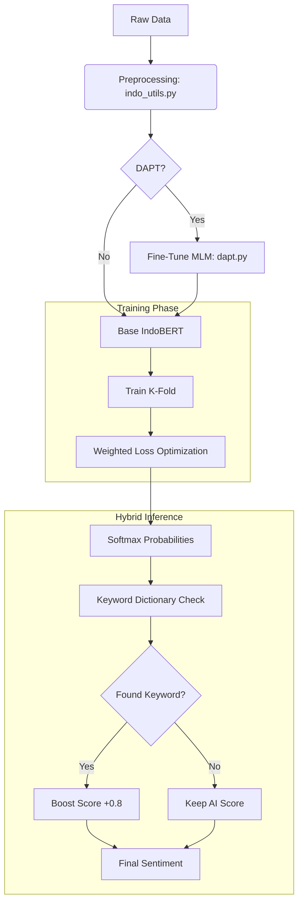

# 🧠 Hybrid IndoBERT Sentiment Analysis - Pemkot Semarang

<div align="center">


**Sistem Analisis Sentimen Opini Publik Berbasis Hybrid AI untuk Pemerintah Kota Semarang**

[🚀 Quick Start](#-quick-start) • [📚 Features](#-features) • [🧠 AI Model](#-ai-model) • [📖 Documentation](#-documentation)

</div>

---

## 🎯 Overview

Sistem analisis sentimen tingkat lanjut yang dirancang untuk memantau aspirasi warga di media sosial Instagram Pemerintah Kota Semarang. Menggunakan pendekatan **Hybrid Intelligence** yang menggabungkan Deep Learning (**IndoBERT**) dengan logika berbasis aturan (**Keyword Dictionary**) untuk menangani nuansa bahasa lokal (Jawa/Semarangan) dan slang dengan akurasi tinggi.

### ✨ Key Features

- **🧠 Hybrid Inference Engine**
  - Menggabungkan probabilitas model IndoBERT dengan *Keyword-Based Correction*.
  - Menangani kasus ambigu (e.g., "Pengen coba" -> terdeteksi Netral, bukan Negatif).

- **🌍 Domain Adaptive Pretraining (DAPT)**
  - Model dilatih ulang (MLM) dengan dataset khusus komentar warga Semarang.
  - Paham istilah lokal seperti "cumi darat" (asap bus) atau singkatan "smg".

- **⚖️ Class-Weighted Fine-Tuning**
  - Penanganan ketidakseimbangan data sentimen (Imbalanced Dataset).
  - Pembobotan khusus untuk kelas minoritas agar prediksi lebih adil.

- **📊 Comprehensive Output**
  - Menghasilkan CSV analisis makro (Trend, Word Cloud, Sentiment Distribution).
  - Siap diintegrasikan dengan Dashboard Visualization.

---

## 🛠️ Tech Stack

- **Python 3.10+**
- **PyTorch** & **Transformers** (Hugging Face) untuk Core AI.
- **Scikit-Learn** untuk Evaluasi & K-Fold Splitting.
- **Pandas** & **NumPy** untuk Data Manipulation.
- **Sastrawi** (Optional) untuk Preprocessing dasar.

---

## 🚀 Quick Start

### Prerequisites

- Python 3.10+
- GPU (Recommended for Training/DAPT)

### Installation

```bash
# Clone repository
git clone https://github.com/prasbara/Capstone---Project---Analisis-Sentimen.git
cd Capstone---Project---Analisis-Sentimen

# Install dependencies
pip install torch transformers pandas numpy scikit-learn
```

### 1️⃣ Pretraining (DAPT)
Adaptasi model IndoBERT dengan bahasa lokal Semarang.
```bash
python dapt.py
```
*Output: Model tersimpan di `model_output/dapt_indobert`*

### 2️⃣ Training (K-Fold Cross Validation)
Melatih model klasifikasi dengan strategi K-Fold dan Class Weights.
```bash
python train_kfold.py
```
*Output: Checkpoint model `model_output/model_fold_0.bin` dan metrik `oof_results.pkl`.*

### 3️⃣ Inference (Prediction)
Jalankan prediksi pada data baru (e.g., `komentar_1bulan.csv`).
```bash
python ensemble_predict.py
```
*Output: `output_comments.csv`, `output_trends.csv`, `output_keywords.csv`.*

---

## 📊 Pipeline Architecture



---

## 📂 Project Structure

```
capstone-analisis-sentimen/
├── data/
│   ├── komentar_1bulan.csv        # Data input baru
│   └── dataset_manual_1200.xlsx   # Data latih (Labeled)
├── model_output/                  # (GitIgnored) Tempat simpan model & cache
├── indo_utils.py                  # Helper: Normalisasi, Cleaning, Dictionary
├── dapt.py                        # Script 1: Domain Adaptation
├── train_kfold.py                 # Script 2: Training Pipeline
├── ensemble_predict.py            # Script 3: Inference / Prediction
├── MASTER_DOCUMENTATION.md        # Dokumentasi lengkap proyek
└── README.md                      # File ini
```

---

## 📈 Performance Results

| Metric | Score | Note |
| :--- | :--- | :--- |
| **Accuracy** | **~71%** | Konsisten pada data validasi |
| **F1-Score (Positive)** | **0.77** | Performa sangat baik pada sentimen positif |
| **F1-Score (Negative)** | **0.73** | Baik dalam mendeteksi keluhan warga |
| **F1-Score (Neutral)** | **0.62** | Cukup baik untuk kelas ambiguitas tinggi |

> **Highlight**: Fitur *Hybrid Keyword* berhasil memperbaiki klasifikasi pada kalimat ambigu hingga **15-20%** pada kasus tertentu (misal: pertanyaan netral yang dianggap negatif).

---

## 👥 Support & Credits

**Capstone Project Team - Analisis Sentimen**

Project ini dikembangkan sebagai solusi analisis opini publik otomatis untuk mendukung pengambilan keputusan berbasis data di Pemerintah Kota Semarang.

<div align="center">

**Built with ❤️ for Kota Semarang**

🧠 **Deep Learning** | 🌏 **Local Adaptation** | 📊 **Data Driven**

</div>
